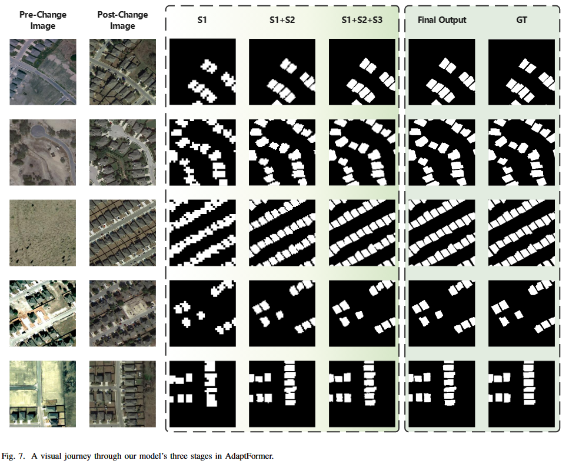
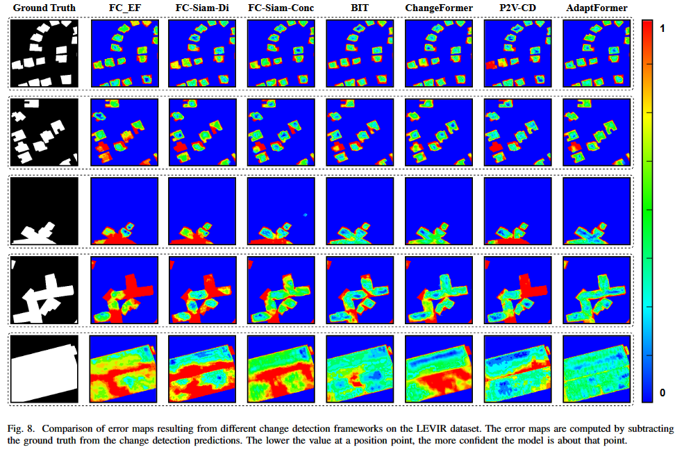

# AdaptFormer: Investigating Hierarchical Semantic Interpretations for Change Detection

[](https://huggingface.co/deepang/adaptformer-LEVIR-CD)&nbsp;


> 🎉 This work is accepted by [IEEE Transactions on Instrumentation and Measurement](https://ieeexplore.ieee.org/document/10497147)

We provide [demo.ipynb](./demo.ipynb) for you to see more technical details about AdaptFormer.

The weights of our model can now be downloaded on [🤗huggingface](https://huggingface.co/deepang/adaptformer-LEVIR-CD)

# Network Architecture


# Data Description

## Dataset Name: LEVIR-CD

The LEVIR-CD dataset represents a significant advancement in the field of remote sensing image change detection. Introduced by Chen et al., this dataset serves as a new benchmark for evaluating change detection algorithms, particularly those based on deep learning techniques.


### LEVIR-CD-256 Version

For our open-source model, we have worked with a modified version of the LEVIR-CD dataset, specifically tailored to a resolution of 256 × 256 pixels. This adaptation, known as LEVIR-CD-256, retains the integrity of the original dataset while providing a more manageable size for certain computational models. You can find more details and access this version [here](https://www.dropbox.com/s/18fb5jo0npu5evm/LEVIR-CD256.zip).

## Dataset Name: DSIFN-CD

The DSIFN-CD dataset is a valuable resource for the field of change detection in high-resolution bi-temporal remote sensing images. Introduced by Zhang et al., this dataset is designed to facilitate the development and evaluation of image fusion networks for detecting changes over time.

### DSIFN-CD-256

In the DSIFN-CD-256 version, these images have been resized to 256 × 256 pixels, providing a more compact yet equally informative dataset for change detection tasks. This modification allows for faster processing times and reduced computational requirements, making it an ideal choice for deep learning models with limited resources.You can find more details and access this version [here](https://www.dropbox.com/s/18fb5jo0npu5evm/LEVIR-CD256.zip).


# Install dependencies

```
pip install -r requirements.txt
```

# Training

The ```training_config.json``` is the global parameters control file. Dataset loading and related parameter selection are controlled through the variables of ```root_dir``` in ```training_config.json```.

```shell
accelerate-launch trainer.py
```


# Results


# Visualization







# Bixtex
```bib
@ARTICLE{10497147,
  author={Huang, Teng and Hong, Yile and Pang, Yan and Liang, Jiaming and Hong, Jie and Huang, Lin and Zhang, Yuan and Jia, Yan and Savi, Patrizia},
  journal={IEEE Transactions on Instrumentation and Measurement}, 
  title={AdaptFormer: An Adaptive Hierarchical Semantic Approach for Change Detection on Remote Sensing Images}, 
  year={2024},
  volume={},
  number={},
  pages={1-1},
  keywords={Semantics;Remote sensing;Feature extraction;Data mining;Adaptation models;Transformers;Task analysis;Change Detection;Hierarchical Representation Learning;Remote Sensing;Representation Fusion;Deep Learning},
  doi={10.1109/TIM.2024.3387494}}
```
